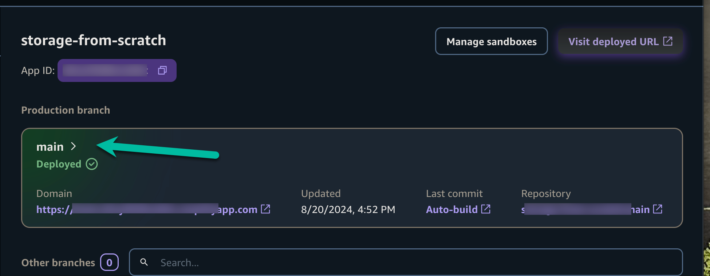
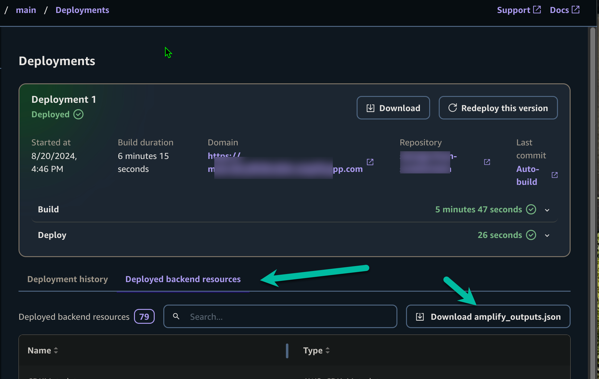
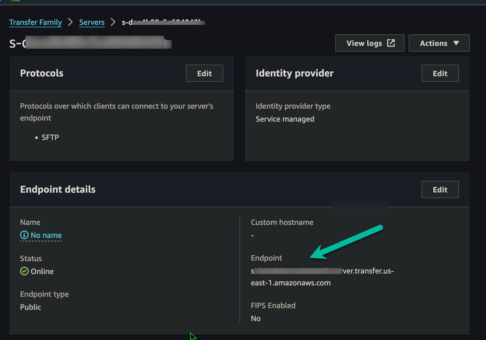
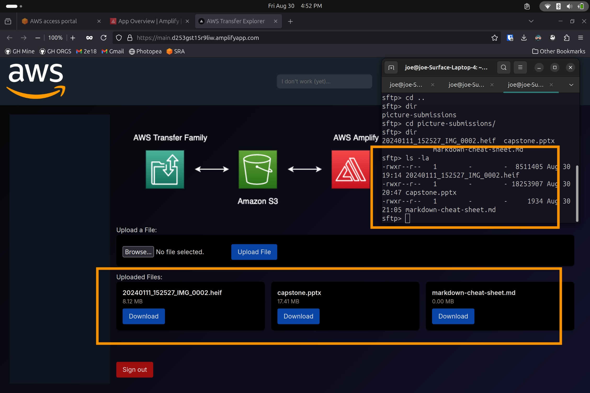

# AWS Transfer + S3 + Amplify Web Interface POC

## Summary

This project demonstrates a scalable, cost-effective solution for managed file transfers using AWS Transfer for SFTP and Amazon S3, coupled with a user-friendly web interface built with AWS Amplify and Next.js. This combination addresses the challenge of providing easy access to files stored in S3 via SFTP transfers for standard internal users via a web interface a common use case seen in the field.

Key benefits:

* Replaces on-premises SFTP servers with a fully managed, scalable AWS Transfer service
* Utilizes S3's durability, availability, and cost-effectiveness for file storage
* Provides secure, authenticated access to files through Amplify's fully managed Storage and Auth modules leveraging Amazon Cognito and IAM roles to manage access.
* Offers a customizable web interface for easy file management
* Enables scalability and flexibility to adapt to various use cases

This repository contains the code for the web interface, serving as a starting point for your own implementation. Follow the instructions below to deploy this proof of concept in your AWS environment.

## Deployment Instructions

### 1. Create a Repository

1. To follow this tutorail, fork or clone this repository to your own GitHub account. 

### 2. Set Up AWS Amplify

1. Log in to the AWS Management Console and navigate to AWS Amplify.
2. Click "Create new app" and choose the Github.
3. After you click next you will authenticate to Github if needed and then be prompted to select your repository and branch.
4. Accept the remaining defaults, after you click "Save and deploy" the app will deploy itself .
5. Once deployed you can see your app by visiting the "Domain" in your app overview, you an register via the "Sign Up" tab on the login page

### 3. Retrieve S3 Bucket Name

1. In your Amplify app, go to the Overview tab of your deployed app and click into it:

2. Click the "Deployed backend resources" tab and then "Download amplify_outputs.json" Retrieve S3 Bucket Name 

3. Open the file and locate the `storage` section.
4. Note the `BucketName` value under your storage resource.
5. If you decide to pull and run the next.js app, putting this file in the root directory will allow you to interact with your amplify environment when running the app locally.

### 4. Set Up AWS Transfer for SFTP

1. Navigate to AWS Transfer Family in the AWS Management Console.
2. Click "Create server".
3. Choose "SFTP" as the protocol and "Service managed" for identity provider.
4. Configure endpoints as needed.
5. Select Amazon S3 as the Domain
6. Review and create the server after adjusting any remaining details, we are using defaults.

### 5. Add SFTP User

 1. Create a role for your sample SMTP server that allows access to your bucket noted above in the IAM console
 2. You will need the public key of the user/computer you intend on connecting to the sftp server ready to continue the demonstration.
 3. Once your Transfer server is created, go to the "Users" tab.
 4. Click "Add user".
 5. Enter a username and choose "Service managed" for the access.
 6. Select your role from above
 7. Select "None" for policy
 8. For "Home directory", enter the S3 bucket name you noted earlier.
 9. Add SSH public key for authentication.
10. Review and create the user.
11. Test the user by getting the "Endpoint" from Servers page and connect.
12. Enter a username and choose "Service managed" for the access. 

13. You can now upload files into the picture-submissions folder and see them from the amplify front end.

## Next Steps

With these steps completed, you now have a functioning proof of concept demonstrating the integration of AWS Transfer, S3, and Amplify for secure file management. Users can upload files via SFTP, which will be stored in S3, and access them through the web interface provided by this application.